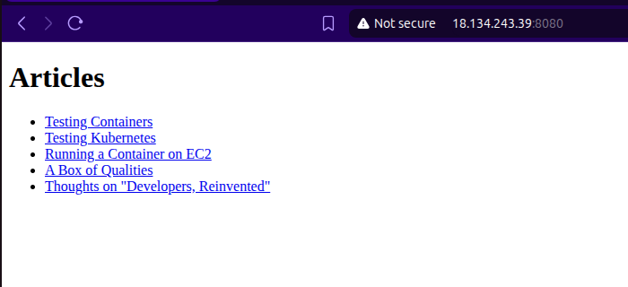

The last piece I wrote was me bumbling about with Kubernetes; specifically, with minikube running on my local machine. This is great, except it's not, because why would I need to have an autoscaling static website when it's running only on my local machine and no-one can try to DDOS it.

## Insert pun about clouds here...

I'm going to take a step back from Kubernetes and automated deployment pipelines and focus instead on getting the current state of things accessible on a cloud machine. Obviously, that cloud is going to be AWS, as that's the name of this series, and equally obviously, that machine is going to be a linux machine because I enjoy feeling superior to mortals who have to suckle at the crusty teat of Papa Gates. I should add that this is definitely a joke, I truly cannot manage my linux machines yet, but I switched desktops recently to Ubuntu and just, oh my lord, the lack of bloatware, it's gorgeous - everything runs smoothly again.  

Let's start with provisioning an EC2 instance. EC2 stands for Elastic Cloud Compute and is one of the oldest services offered by AWS: rented space on a machine. I just need a basic piece of hardware within the free tier, which basically guarantees I'll be using the t2.micro image.  

Next, I need to consider containers. I think, with my uneducated non-cloud-native monkey brain, there are two main approaches I could take in the long run here. I could do some sort of jiggery-pokery with GitHub Actions and GitHub Container Registry, or I can do some sort of pokery-jiggery with elastic container registry. I don't know which is the right approach - I'll probably end up trying both, since I know too little to enen orient myself towards the correct option for my usecase, or whether the previous sentence exposed me as an absolute fraud - but that feels like its own huge problem on its own. I suppose the other option is just to ssh into the EC2 instance, clone this entire repo, build the image, run the container, and bada-bing bada-boom. Seems like a lot, but at least I know all the steps.  

I'm going to steer clear of any screenshots from the AWS console, as I don't yet know it well enough to know if there's any sensitive information that might constitute a major screw-up if I were to show it. For now, imagine some quiet clicking, a muttered curse as I enter a field incorrectly, then a hypersonic whooshing noise (I presume) as the instance starts, followed by some quick man-searching for how to use a .pem file with ssh.  

Cool, Ubuntu immage up, ssh-ed into, sudo of. Next step - well, there are two options actually. I could faff around with Git, or I could just try using **rsync** to get the relevant files up into the cloud instance. Obviously, this is even more manual and crappy than my plan with Git, but it again has the advantage of being super easy to do.  

After some deep research (read - Googling), it seems that there's a standard form used to rsync to an EC2 instance, where you pass ```ssh -i path/to/pem``` as a parameter for the -e option. Good stuff. The other advantage of going with rsync is that I have the python virtual environment for this project immediately setup, and in theory I should just be able to get things going straight away.  

Now that I have committed that sentence to digital paper, let me see if I am correct...  

- So far, missing make...  
- Whoops, didn't allow https in/outbound on the security group, so I can't get some of the packages I need. Fortunately, I can edit that live-time...  
- Ah, ok. The python virtual environment is, in part, hard links to my python install on my local machine, which obviously doesn't work here. I don't know if that's because I've made a mistake, or if that's expected, so I'll need to put a pin in it and come back to that question. In the meantime, I need to install a full python install here. Fortunately, I also have a script for that.  
- Okay...ah, user needs to be part of the docker group. I am going to double check the command for this, because when I did this on my home workstation, I accidentally removed myself from sudo and had to drop into recovery mode.  
- Right, yeah, I switched this to expose port 8080 on the machine to map to the container's port 80, I should change that...  



Look upon my works and despair, for I am mighty!  

## Can I get an update in here?

Ideally, I'd like to be able to update the content of the website quickly, even just to get this writeup loaded and available. Evidently I have plans about how to do this properly in the near future with proper pipelines, but perhaps I can just write a quick section in the make file to run rsync, stop the container, and then build and run it again?  

Turns out, yes, so long as I make sure to exclude my local python virtual environment in favour of the one that I created manually on the server.  

Strangely easy, with all said and done. Next up, I think, will be a better approach to amange these containers and changes. I also don't think I should be having to rebuild the container for a simple change to the files getting served, so I should investigate mounts or volumes. Until next time.
